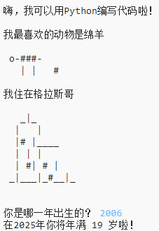

## 介绍

你将在本项目中学习如何编写一个 Python 程序来向他人进行自我介绍。

### 你将做出什么

  <iframe src="https://trinket.io/embed/python/a1f663ae0d?outputOnly=true&start=result" width="600" height="500" frameborder="0" marginwidth="0" marginheight="0" allowfullscreen>
  </iframe>
  

### 你将学习什么

本项目包括 [Raspberry Pi 数字制作课程](http://rpf.io/curriculum){:target="_blank"} 以下几个部分的元素:

+ [使用基本编程结构创建简单程序。](https://www.raspberrypi.org/curriculum/programming/creator){:target="_blank"}

### 更多教师参考信息

如果你需要打印本项目，请使用 [适合打印机的版本](https://projects.raspberrypi.org/en/projects/about-me/print){:target="_blank"}。

使用页脚中的链接访问本项目的 GitHub 资源库，‘en/resources’文件夹中包含所有资源（包括已完成项目示例）。
