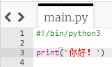
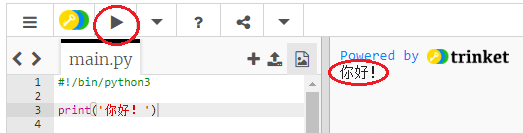
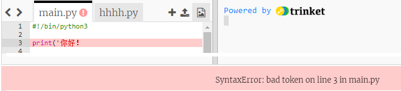
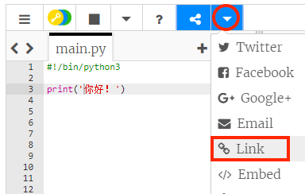

## 问候

让我们先从打字开始。

+ 单击链接<a href="http://jumpto.cc/python-new" target="_blank">jumpto.cc/python-new</a>，打开空白的Python编码页面。

+ 在窗口键入以下内容：
    
    
    
    首行的`#!/bin/python3`只是为了告知Trinket我们使用的是最新版本的Python编程系统（Python 3）。

+ 单击**运行** ，运行结果会显示` print()`命令中打印引号`''` 之间的所有内容。
    
    

如编程出现错误，屏幕上会显示错误信息，告诉你到底出了什么问题！

+ 试一下 删除后引号`‘`或者闭括号`)`（或者两者一起删除），运行程序，看看会发生什么。
    
    

+ 重新添加引号或括号，然后单击**运行**，确保项目能够再次运作。

**您不必注册Trinket帐户来保存项目！**

如果您没有Trinket帐户，请单击向下箭头，然后单击**链接** 。 页面会显示此项目的链接。你可以先保存，并在稍后继续编辑你的项目。 每次进行项目编辑都会导致链接的更改，因此不要忘记更新保存的链接！

如果您注册了Trinket帐户，可以单击** Remix **保存自己的编程文件副本。

