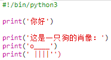
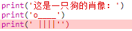
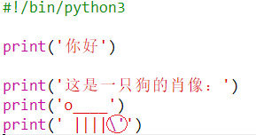
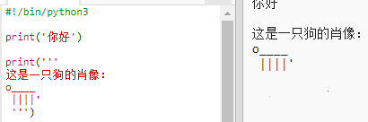

## ASCII 艺术

让我们来打印一些比文本更有趣的东西：ASCII 艺术! ASCII 艺术（读作‘_ask-e_’（阿斯克-易））是__用文本创建图片__。

+ 让我们来给你的程序添加一些艺术效果——一张狗的照片！

    

用管道字符 `|` 做狗的四条腿，在大多数英式/美式英语键盘上，按下 <kbd>Shift + \ </kbd>可打出管道字符。 

+ 点击 **Run**，你会发现你的新代码中存在一个错误。

    

    这是因为你的文本含有一个撇号 `'`，Python 认为这是文本的结束！

    

+ 要解决这个问题，只要把一个反斜杠 `\` 加在 `here's` 的前面就行了。这样就能告诉 Python，撇号是文本的一部分。

    

+ 如果你愿意，可以使用三个撇号 `'''` 而不是一个撇号，这样你就能用一个 `print` 语句打印出多行文本：

    
