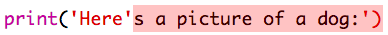

## ASCII字符画

让我们打印一些比文本更有趣的东西——ASCII字符画。 ASCII字符画（发音为*ask-e*）是一种通过**文本创作的文字图像**。

+ 现在让我们在已编写的程序里加张文字图像——一只狗！
    
    

这只狗的腿用字符`|`代替，同时按<kbd>Shift 与 \ </kbd>键即可。

+ 如果单击**运行**，屏幕上会显示代码里存在一个错误。
    
    
    
    因为你的文本里包含一个撇号`'`，Python认为文本到此就结束了！
    
    

+ 只要在象征狗尾巴的撇号前面加上一个反斜线``，这个问题就迎刃而解。 反斜线告诉Python撇号是文本内容的一部分。
    
    

+ If you prefer, you can use three apostrophes `'''` instead of one, which allows you to print multiple lines of text with one `print` statement:
    
    