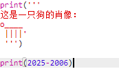
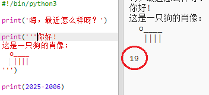
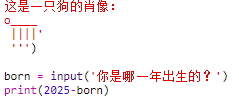
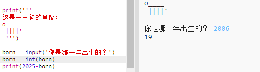
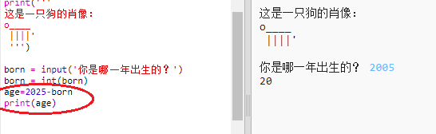
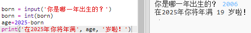

## 2025 年

你还可以进行计算，并打印数字。我们来看看你在 2025 年有多大！

+ 要计算你在 2025 年的年龄，方法是用 2025 减去你的出生年份。

    向你的程序中添加以下代码：

    

    请注意，不要在数字周围加上引号。（如果你出生在其他年份，则需更改数字 `2006`）。

+ 点击 **Run**，你的程序就能打印出你在 2025 年的年龄。

    

+ 你可以改进你的程序，方式是使用 `input()` 询问用户的年龄，并将问得的年龄存储在被称作 `born` 的 __变量__ 中。

    

+ 运行你的程序，并输入你的出生年份。你是不是得到了一个错误消息？

    这是因为你输入程序的是 __文本__ ，它需要被转换成 __数字__。

    你可以使用 `int()` 将文本转换成一个 __整型数__ 。整型数表示整数。

    

+ 你还可以创建另一个变量来存储计算结果，并将其打印出来。

    

+ 最后，通过添加实用消息，你可以使程序变得更加易懂。

    

