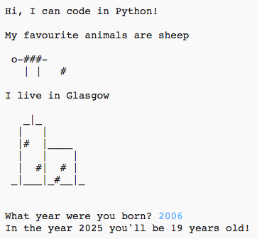

## 介紹

在這個專案中, 你將學習如何編寫一個 Python 程式, 告訴人們關於你的一切。

### 你會做什麼

  <iframe src="https://trinket.io/embed/python/a1f663ae0d?outputOnly=true&start=result" width="600" height="500" frameborder="0" marginwidth="0" marginheight="0" allowfullscreen>
  </iframe>
  

### 你會學到什麼

此項目涵蓋 [Raspberry Pi數字化課程](http://rpf.io/curriculum){：target =“_ blank”}的下列部分：

+ [使用基本的編程結構來創建簡單的程序](https://www.raspberrypi.org/curriculum/programming/creator){：target =“_ blank”}

### 給教育工作者的額外資訊

如果需要列印此專案, 請使用 [ 印表機友好版本 ](https://projects.raspberrypi.org/en/projects/about-me/print) {: 目標 = "_blank"}。

使用頁腳中的連結可以訪問此專案的 GitHub 存儲庫, 該資料庫包含 "en/資源" 資料夾中的所有資源 (包括示例已完成專案)。