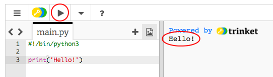

## 打招呼

首先，我們來寫一些字。

+ 打開空白的 Python 模板： <a href="http://jumpto.cc/python-new" target="_blank">jumpto.cc / python- new</a>。

+ 在出現的視窗中輸入以下內容：
    
    
    
    `#!/bin/python3` 這一行是在告訴 Trinket 我們要使用 Python 3 (最新的版本) 。

+ 點擊 **Run**，您應該會看到 `print()` 命令會將引號 `“`之間的所有內容印出來。
    
    

如果你犯了錯誤，你會得到一個錯誤信息，告訴你什麼出了問題！

+ 試試看！ 刪除結束報價 `'` 或右括號 `）` （或兩者），看看會發生什麼。
    
    

+ 重新添加報價或支架，然後單擊 **運行** 以確保您的項目再次運行。

**你不需要一個飾品賬戶來保存你的項目！**

如果您沒有飾品帳戶，請點擊向下箭頭，然後點擊 **鏈接**。 這會給你一個鏈接，你可以保存並返回到以後。 每次進行更改時都需要執行此操作，因為鏈接將會更改！

如果您有飾品帳戶，則可以單擊 **混合** 以保存您自己的飾品副本。

