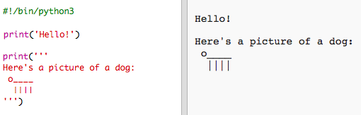

## ASCII藝術

讓我們打印比文本更有趣的東西：ASCII藝術！ ASCII藝術（發音為'*ask-e*'）正在從文本</strong>中創建 **個圖片。
 

+ 讓我們給你的程序添加一些藝術 - 一隻狗的照片！
    
    

狗的腿是用管道字符 `|製成的您可以在大多數英國/美國英語鍵盤上按 <kbd>Shift + \ </kbd> 鍵入`。

+ 如果您點擊 **運行**，則會看到新代碼中存在一個錯誤。
    
    
    
    這是因為您的文本包含一個撇號 `'`，Python認為它是文本的結尾！
    
    

+ 要解決這個問題，只需在撇號 `這裡的`之前加一個反斜杠 ``。 這告訴Python撇號是文本的一部分。
    
    

+ If you prefer, you can use three apostrophes `'''` instead of one, which allows you to print multiple lines of text with one `print` statement:
    
    