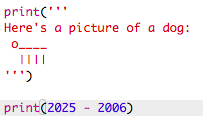

## 西元2025年

你也可以做數學計算和印出數字。 來計算看看你在2025年時的年齡吧！

+ 要計算你在2025年時的年齡，你需要用2025年減掉你出生的那一年。
    
    將這段程式碼加進到您的程式中：
    
    
    
    請注意，你不需要在數字前後加上引號。 (如果您不是出生於`2006`年 ，你需要改一下這裡的數字。)

+ 點擊 **Run**，你的程式應該會印出你在2025年時的年齡。
    
    

+ 您也可以使用 `input()` 向用戶詢問其年齡，並將其儲存在名為 `born` 的 **變數** 中，以改良程式。
    
    

+ 啟動您的程式，然後輸入你出生的那一年。 你有收到另一個錯誤訊息嗎？
    
    這是因為鍵入到程式中的任何內容都會是 **文字**，您需要把它轉換成 **數字**。
    
    您可以使用 `int()` 將文字轉換成 **整數**。 整數指的是沒有小數點的數。
    
    

+ 您也可以建立另一個變數來儲存計算結果，再把它印出來。
    
    

+ 最後，添加一些有用的消息，可以讓您的程式更容易理解。
    
    